# Materiales.com.py – förbättringsrapport 5 oktober 2026

Leveransen förbättrar vägen kategori → material → mängd → offertlista → mottagen förfrågan i den befintliga PHP-sajten. Alla befintliga SEO-adresser, länkar och metadata har bevarats. PR skapas redo för granskning enligt Antons senaste instruktion, utan merge. Ingen publicering, DNS-ändring eller produktionslead har genomförts.

## Källa och leverans

- Live: https://materiales.com.py/ – granskad först på 1440 × 1000 och 390 × 844.
- Repo: https://github.com/antonmarklundcom/materiales
- Bas: `main`, `83f4023466d8b0d4c1d9261aaed1ec0a21d3e5fc` (Keyword Planner, PR #60). Tidigare affärsbeskrivning och redesign är redan mergade. Inga öppna PR:er fanns vid start.
- Arbetsgren: `codex/materiales-catalogo-offer-review`, separat checkout. Samlingsmappens andra lokala arbeten är bevarade.
- Lokal checkout: `C:\Users\anton\OneDrive\Documents\ChatGPT\Websites Oct26- and beyond\materiales`
- Rapport och bilder: `C:\Users\anton\OneDrive\Documents\ChatGPT\Websites Oct26- and beyond\materiales\docs\review-2026-10-05`
- Preview: http://127.0.0.1:8087/ – PHP 8.3.33, befintlig lokal router. PHP-servern använder separat temporär lagring. Ingen Node-server behövs i drift.
- PR-adress och GitHub-resultat läggs i [LEVERANS.md](LEVERANS.md).

Live och basgrenen ger samma inventerade metadata, schema, sitemap och befintliga länkar. Robots skiljer bara i Windows radslut. Det finns ingen publik commitstämpel på servern; jämförelsen fastställer innehållsparitet, inte exakt servercommit.

Lästa underlag: hela uppdragstexten, AGENTS.md, README, STATUS, KNOWN-ISSUES, DEPLOY, BUSINESS, CONTENT-SPEC och relevanta plan-/designavsnitt. PHP, HTML, CSS och vanlig JavaScript behålls.

## Livefynd och affärsroll

Sajten är en katalog och offertförmedling med vägledning. Den är inte en butik som säljer eget lager eller tar betalt online. Befintlig kod tar emot förfrågningar, bygger VenderCRM-payload och kan vidarebefordra till CRM. Leverantörskontakten sker enligt ägardokumenten manuellt, med upp till tre offerter som mål. Ett registrerat lead innebär inte att en leverantör fått eller besvarat det.

Inventeringen omfattar 14 kategorier, 93 material, 21 guider, 10 kalkylatorer och 149 sitemapadresser. Navigation, brödsmulor, omfattande texter, responsiva materialbilder, lokala typsnitt och befintliga offert-/leverantörsflöden fungerar och återanvänds.

De viktigaste problemen var att katalogval kom sent på startsidan, materialval låg efter långa kategoritexter, det saknades ett användbart katalogfilter och kalkylatorerna kunde använda negativa eller för stora inmatningar trots visade intervall. Synliga malltexter lovade verifierade leverantörer och svar samma dag utan aktuell verifiering i tillgängliga dokument.

Ägaren tillfrågades samlat om CRM-status, verifierade rubriker/zoner och godkänd WhatsApp-mottagare. Inget svar har kommit. Serverkonfigurationen har inte lästs; dokumentets historiska `solo_log`-status är inte bevis för dagens driftläge.

## Genomfört förbättringspaket

1. Startsidan ger först materialval, sedan kategoriöversikt och två nästa steg för kalkylator/materiallista. Den befintliga mörka/gula identiteten och bilderna bevaras. Den förklarar att sajten tar emot och koordinerar en konsultation utan onlineförsäljning eller betalning.
2. Katalogen har accentoberoende filtrering över namn, kategori, enhet och befintliga synonymer. `aridos` hittar sju material och `blindex` hittar Vidrio templado. Antal, nollresultat, återställning och Escape finns. Alla 93 materiallänkar ligger fortfarande i serverns HTML även utan JavaScript. Ingen ny sök-URL eller `SearchAction` uppfinns.
3. Kategorier visar materialval före den långa läsningen. Befintliga texter och tabeller finns kvar. Genvägar till material och läsning, samt förberedelse med mängd, enhet, mått, zon och befintliga relaterade kalkylatorer, gör sidan enklare att använda.
4. Formulären visar enhetshjälp från befintliga materialdata och förklarar att mottagen konsultation inte bekräftar lager, leverantörsöverföring eller köp. Inga priser, lager, leverantörer, täckningsområden eller svarstider har uppfunnits. Pris och frakt bekräftas av den som lämnar offert.
5. Samtliga tio kalkylatorer avvisar tomma, ogiltiga, negativa och övergränsade inmatningar. Ogiltiga resultat döljs, automatisk mängd töms och resultatlänken/paketknappen stoppas. Egen manuellt skriven mängd skrivs inte över. Formler, spill, avrundningar och materialantaganden ändras inte.
6. Tackvyn skiljer mottagen förfrågan från vidarebefordran. Befintligt CRM, servervalidering, formulärsignering, honeypot, samtyckestext/versioner, payload, begränsningar och privata loggar bevaras. Leverantörsformulärets befintliga mottagning och rutning behålls.
7. Befintligt smoke-test fungerar nu även på Windows utan flerradig shell-inmatning och med kontrollerad städning av endast testets egna temporära kataloger. Render-testets markupmönster följer nya attribut; Git Bashs felaktiga konvertering av formulärfältet `origen` förhindras. CI:s enda befintliga job får två relevanta regressionstester och ingen deployment.

## Bevarad SEO

Jämförelsen är gjord både mot den rena basgrenen och mot live. För alla 151 inventerade sidor (149 sitemapadresser plus tack och avsiktlig 404) är status, slutlig sökväg, title, H1, samtliga name/property-meta, canonical och parsed JSON-LD identiska. Sitemapens XML och URL-lista samt robotsdirektiv är bevarade; endast CRLF/LF normaliseras för robots.

Ingen tidigare länk har tagits bort från någon inventerad sida, inklusive befintliga kontaktlänkar. 124 länktillägg räknas över sidorna; detta är inte 124 nya unika URL:er. `data/`, redaktionella `content/`, sitemap, robots, schemafunktioner och canonical-logik är orörda. Befintlig indexering och `/gracias/` noindex bevaras. Brödsmulorna finns kvar. Det nya filtret ersätter inte serverrenderade länkar.

Ägarens uttryckliga instruktion att behålla SEO-data innebär också att äldre affärspåståenden i metadata/schema och långa texter inte har skrivits om. De är därför **inte aktuellt verifierade av denna leverans**. Nya synliga malltexter är försiktigare. Ägaren behöver verifiera de kvarvarande påståendena före publicering eller uttryckligen godkänna en separat innehålls-/metadatarevision. Rapporten påstår inte att alla gamla löften har tagits bort eller att ranking har mätts.

Underlag: [live](seo-live.json), [bas](seo-before.json), [efter](seo-after.json), jämförelseverktyg `tools/seo-regression.py`.

## Före och efter

Före är faktiskt fångad live, efter är lokal preview. Desktop 1440 × 1000; mobil 390 × 844. Startsidan före desktop visar den ursprungliga cookiepanelen, medan efterbilden och mobilbilderna är tagna efter avvisade valfria cookies. Det är en tillståndsskillnad, inte en borttagen cookiefunktion.

| Vy | Före | Efter |
|---|---|---|
| Startsida desktop | 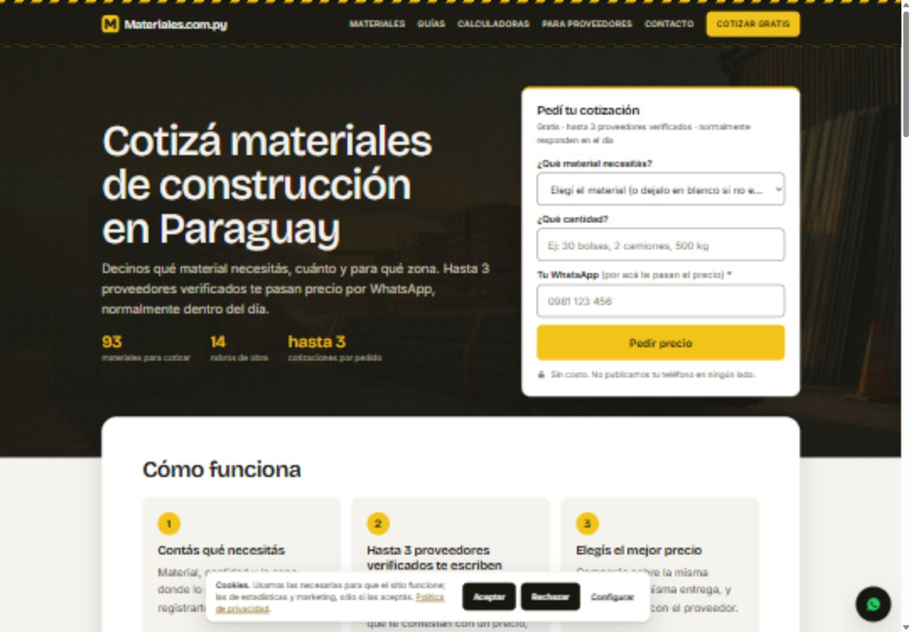 |  |
| Startsida mobil | 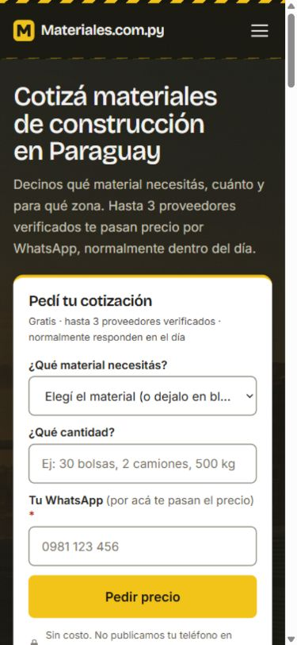 | 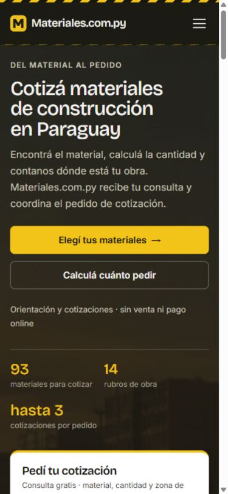 |
| Cemento y cal desktop | 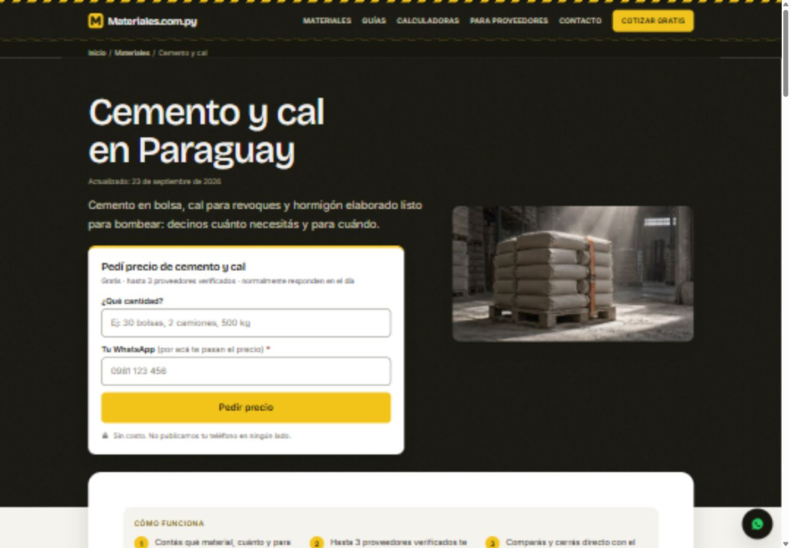 | 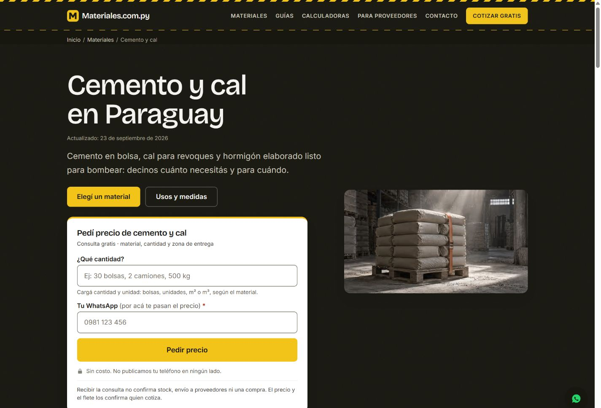 |
| Cemento y cal mobil | 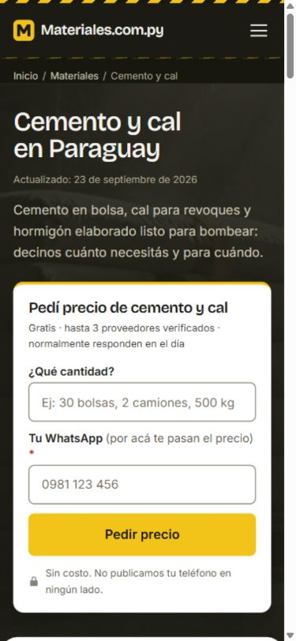 | 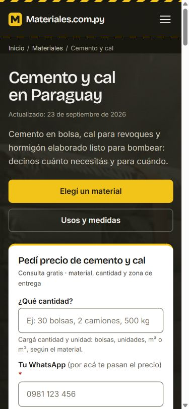 |
| Offert desktop | 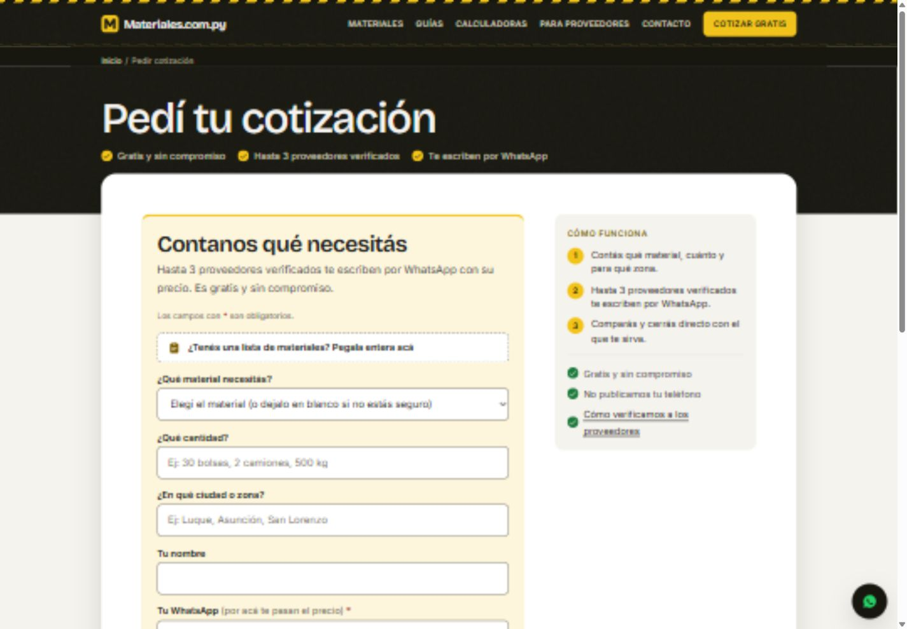 | 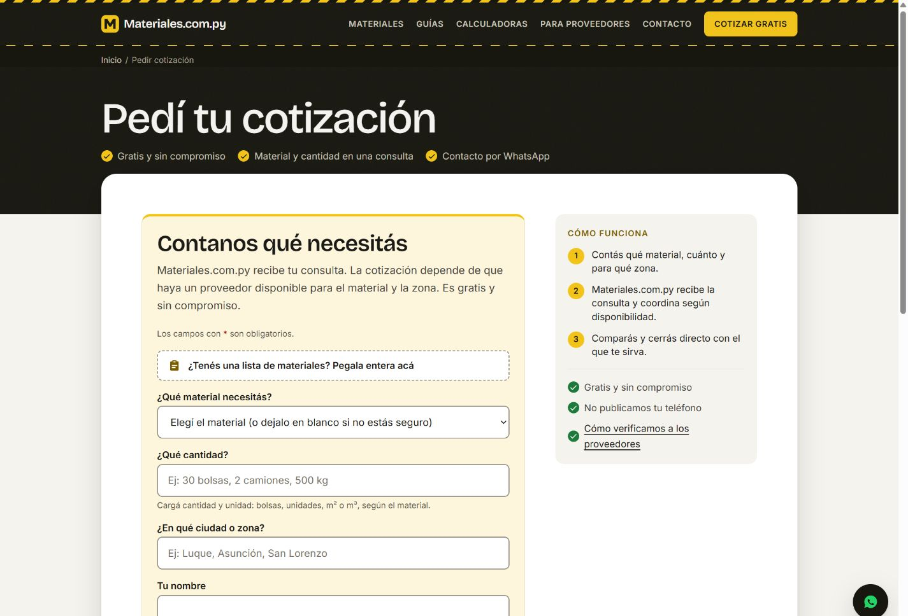 |
| Offert mobil | 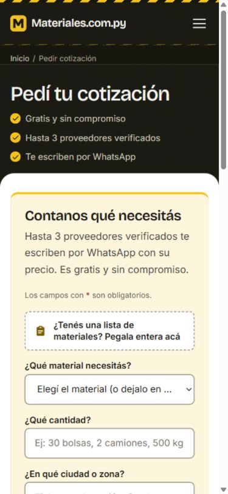 | 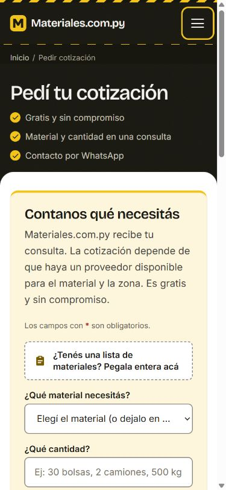 |

Funktionella efterbilder: [katalogfilter](after-catalog-filter-desktop.jpg), [ogiltig kalkylator](after-calculator-invalid-desktop.jpg), [offertvalidering](after-quote-validation-mobile.jpg).

## Faktiska kontroller

| Kontroll | Resultat / omfattning |
|---|---|
| PHP-syntax | Godkänd, 191 PHP-filer |
| Befintligt smoke-test | Godkänt: datareferenser, 107 material-/kategorislugs, metadata, leadvalidering, signering, throttling, samtycke och driftverktygens fixtures |
| Rewrite-paritet | Godkänd mellan `.htaccess` och lokal router |
| Befintligt render-test | Godkänt; [hela utskriften](render-check.txt) |
| Kalkylatorregression | Godkänd, 270 kontroller med samtliga tio verkliga formelspecifikationer, kända exempel, gränser, tomt, Infinity, återhämtning, offertmängd och paket |
| Lokal CRM-mock | Godkänd: köparlista, leverantör, identisk retry/idempotens, 201/200 framgång och 422/500 fel. Endast loopback; ingen verklig leverantör eller produktionsconfig |
| SEO mot bas och live | Godkänd, 149 sitemap-URL:er/151 sidor; inga borttagna metadata eller länkar |
| Publika resurser och ankare | Godkänt: 261 mål (inklusive avsiktlig 404), 409 ankare, 14 skyddade sökvägar och tre 301-slashomdirigeringar; [resultat](public-audit.json) |
| Responsiv webbläsargranskning | 9 sidtyper × 320/390/1440 = 27 kontroller. Ingen horisontell överbredd; ett H1 per vy. [Mätdata](responsive.json) |
| Faktiska interaktioner | Filter med/utan träff, reset; kalkylator 2 m³ → 16 säckar + 1,1 m³ sand + 1,65 m³ ripio; negativt värde spärras; offertpaket överförs; listläge; felaktig telefon stoppas utan förlust av ifyllt namn; meny Enter/Escape på 390 px |
| Produktionskontroll, läsande | Publika resurser 200, 22 privata vägar 403, fem säkerhetsrubriker finns. Ett test misslyckas: `http://www` använder två 301-hopp, sedan rätt HTTPS-apex med 200. [Utskrift](prod-check.txt), [bekräftad kedja](www-redirect-headers.txt) |

Sidor i responsiv kontroll: startsida, katalog, kategori, material, kalkylator, offert, guideindex, leverantörer och kontakt. Tillgänglighet bedömdes manuellt för läsbarhet, fokus, meny, formulär och återkoppling. Ingen Lighthouse-poäng, formell WCAG-certifiering eller komplett skärmläsarrevision har mätts. Laddning/resurser kontrollerades visuellt och med HTTP-status; inga Core Web Vitals utlovas.

De nya testerna körs i CI. [Lokala kontroller](checks.txt) och PR:ns faktiska CI-status redovisas separat. Det befintliga hormigón-exemplet avrundar vatten i text till 962 liter medan JS rundar 962,5 till 963; detta är en tidigare redaktionell avrundningsskillnad, dokumenterad utan att ändra SEO-text eller dosering. Estimat är inte konstruktionsintyg.

## Higgsfield – budgetlogg

Aktuell katalog kontrollerades och exakt GPT Image 2.5 / Sunburst / Medium finns. Befintliga användbara hero- och kategoribilder återanvänds med sina format, responsiva varianter och alt-texter. Ingen betald generation behövdes; inga jobb skickades, inga variationer eller omförsök gjordes.

| Jobb-id | Antal | Kvalitet | Uppskattad kostnad | Faktisk debitering för arbetet | Kvar av uppdragets tak |
|---|---:|---|---:|---:|---:|
| Inga jobb | 0 | Befintliga bilder | 0 krediter | 0 krediter (inga jobb) | 50 krediter |

Detta är uppdragets förbrukning, inte ett påstående om kontots saldo. Inga köp eller abonnemang, inga nya bildpåståenden om utförda projekt eller produktprestanda.

## Rangordnade ägarbeslut och publiceringsberoenden

1. **CRM och verklig mottagning.** Bekräfta dagens CRM-konfiguration, vem som bevakar mottagna/avvisade leads, driftaviseringar och eventuell historisk backlog. Lokala tester verifierar kodens adapter, inte anslutning eller bemanning i produktion. Vidarebefordran och replay är externa åtgärder som inte har utförts här.
2. **Leverantörer och påståenden.** Bekräfta vilka rubriker/zoner som verkligen täcks, verifieringsrutinen och stöd för äldre metadata/schema/texter om verifierade leverantörer och svarstid. Ingen lista över aktuella anslutna leverantörer fanns i underlaget.
3. **Kontakt och ansvarig.** Bekräfta att befintliga +595 992 279 599 är godkänd mottagare. Tillför verklig ansvarig/företagsuppgifter där de saknas och gör den redan dokumenterade integritetsgranskningen. Numret och kontaktlänkarna är bevarade, inte godkända på nytt av mig.
4. **Driftomdirigering.** Granska Hostingers befintliga HTTPS/www-inställning eller cache för tvåhoppskedjan. Repo-regeln är redan skriven för ett hopp; .htaccess/DNS/hosting har inte ändrats i denna PR.
5. **Efter release.** Kontrollera riktiga mottagningskanaler med ett uttryckligen godkänt test, sitemap i Search Console och mobilupplevelsen live. Inga utskick eller Search Console-ändringar utfördes under detta uppdrag.

Anton angav inte dagens CRM-status, leverantörstäckning, verifieringsunderlag, aktuell kontaktgodkänning eller ansvarigidentitet. Jag ställde en samlad fråga, fortsatte med reversibelt kodarbete, använde lokal mock och lämnade uppgifterna som tydliga beroenden. Den senare instruktionen om en vanlig PR ersätter uppdragstextens draft-regel; PR:n blir därför ready utan att obesvarade uppgifter räknas som bekräftade.

## Publiceringsunderlag

PR:n ändrar kod, testverktyg och dokumentation. Inga datamigreringar, nya tjänster, beroendeinstallationer, konton eller databas behövs. `config/`, `storage/`, temporära PHP-loggar och Python-cache ingår inte i Git. Dokument/tester ligger i redan blockerade mappar; HTTP-skyddet är kontrollerat. Ändringen behöver vanlig deployment av de versionshanterade filerna.

**Merge till `main` kan aktivera det befintliga Hostinger-webhooket** enligt DEPLOY.md. Före merge: läs PR-diffen och grönt CI, kontrollera punkterna 1–3 ovan och bevara serverns befintliga config/storage. Denna session mergear eller deployar inte.

Efter godkänd release: kör befintliga `tools/prod-check.sh`, jämför en ny SEO-snapshot med `seo-live.json`, kontrollera katalog/material/kalkylator/lista/tack i desktop och mobil samt följ verkliga leadstatusar i godkänd driftkanal. Dokumentera www-avvikelsen separat om den kvarstår. Vid regression, återställ via en granskningsbar revert av denna PR; skriv inte över privata loggar eller konfiguration. Se DEPLOY.md för befintlig driftrutin.

Korta nästa-session-instruktioner finns i [NEXT-SESSION.txt](NEXT-SESSION.txt). Arbetet här är klart som lokal granskbar version och PR-underlag; produktionen och ägarberoendena återstår att verifiera inför ägarens mergebeslut.
